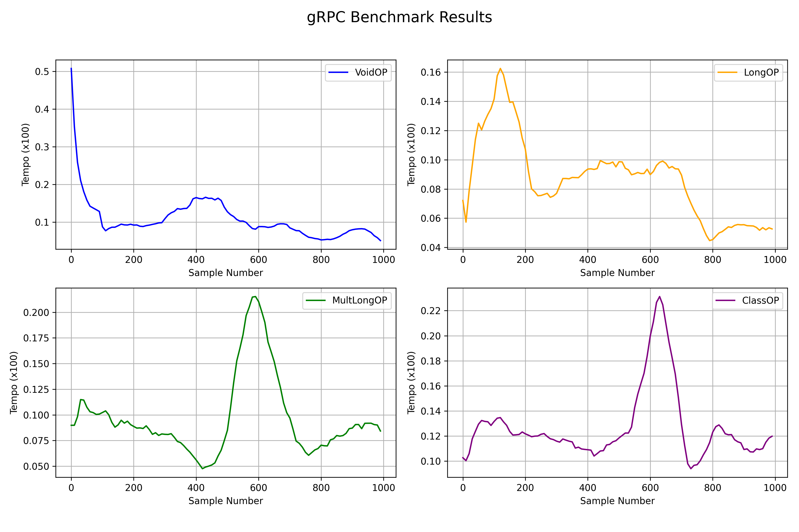

## Informações sobre as máquinas

| Característica     | **Sistema 1 (WSL2)**           | **Sistema 2 (Linux Nativo)**     | **Sistema 3 (VirtualBox)**         |
|--------------------|--------------------------------|----------------------------------|------------------------------------|
| **Usuário**        | root@gustavo                   | gustavo@gustavo                  | gustavo@gustavovboxserver          |
| **OS**             | Ubuntu 20.04.6 LTS (WSL2)      | Ubuntu 24.04.2 LTS               | Ubuntu 24.04.2 LTS                 |
| **Host/VM**        | Windows 10 x86_64              | 550XED P07RGK (nativo)           | VirtualBox 1.2                     |
| **Kernel**         | 5.15.167.4-microsoft-standard  | 6.11.0-24-generic                | 6.0.0-58-generic                   |
| **Shell**          | Bash 5.0.17                    | Zsh 5.9                          | Bash 5.2.21                        |
| **Pacotes**        | 713 (dpkg)                     | 2916 (dpkg), 21 (flatpak)        | 779 (dpkg)                         |
| **Uptime**         | -                         | -                         | -                             |
| **CPU**            | Ryzen 3 3200G (4) @ 3.59GHz     | Intel i5-1235U (12)              | Intel i5-1235U (1) @ 2.50GHz       |
| **GPU**            | Microsoft Device 008e (WSL2)   | Intel Iris Xe (Alder Lake)       | VMware SVGA II Adapter            |
| **Memória usada**  | 738 MiB / 7920 MiB             | 5754 MiB / 7640 MiB              | 203 MiB / 1968 MiB                 |
| **Resolução**      | -                              | 1920x1080                        | 1280x800                           |
| **Interface gráfica** | -                           | GNOME 46, Mutter                 | Nenhuma (TTY)                      |
| **Tema / Ícones**  | Adwaita [GTK3]                 | Yaru-purple-dark [GTK2/3]        | -                                  |
| **Terminal**       | Relay (1205)                   | GNOME Terminal                   | /dev/tty2                          |

$\pagebreak$

## Informações sobre as bibliotecas utilizadas e linguagens de programação

### Bibliotecas
```bash
contourpy       1.3.2
cycler          0.12.1
fonttools       4.57.0
grpcio          1.71.0
grpcio-tools    1.71.0
jsonrpclib      0.2.1
kiwisolver      1.4.8
matplotlib      3.10.1
numpy           2.2.5
packaging       25.0
pandas          2.2.3
pillow          11.2.1
pip             24.0
protobuf        5.29.4
pyparsing       3.2.3
python-dateutil 2.9.0.post0
pytz            2025.2
setuptools      78.1.0
six             1.17.0
tzdata          2025.2
```

### Linguagens
```bash
Python          3.13 Alpine (via Docker)
Python          3.12.3 (Nativo)
Docker          28.1.0
Docker Compose  1.29.2
```

$\pagebreak$

## Análise de desempenho

* Para os testes, foram implementados dois servidores e dois clientes equivalentes, ou seja, que cumpriam a mesma proposta funcional de maneiras diferentes: um utilizando **gRPC** (tecnologia obrigatória para o trabalho) e outro utilizando **JSON-RPC**, escolhido por sua simplicidade de implementação e por ser mais *human friendly* (baseado em HTTP e JSON).
* Nos testes de comunicação via rede, foi utilizada a ferramenta **Wireshark** no lado da máquina servidor, possibilitando a observação detalhada do tráfego de pacotes. Durante as capturas, foi possível identificar um padrão claro na forma como cada tecnologia transmite os dados: o JSON-RPC utiliza o protocolo **HTTP/1.1** com mensagens codificadas em JSON, enquanto o gRPC utiliza **HTTP/2**, com mensagens binárias em formato Protobuf encapsuladas pelo protocolo **GRPCHTTP2**. Essa diferença de protocolos reflete diretamente na forma de multiplexação, compressão e desempenho da comunicação.
* Os tempos de execução das chamadas foram medidos utilizando a função `time.perf_counter()` da biblioteca padrão do Python, que fornece alta precisão na medição de tempo, ideal para benchmarks curtos. Essa função retorna o tempo em segundos com precisão de frações de microssegundos, garantindo maior confiabilidade nas comparações. As medições foram feitas sempre no lado do cliente, considerando o tempo total entre o envio da chamada e o recebimento da resposta — portanto, englobando tanto o tempo de processamento no servidor quanto o tempo de ida e volta dos pacotes na rede.
* Vale destacar que cada gráfico apresentado representa apenas uma captura de execução. Os resultados podem variar entre diferentes execuções, ambientes ou máquinas, e o objetivo principal é observar padrões e comportamentos típicos das tecnologias analisadas, e não valores absolutos fixos.
* Vale destacar também que todos os testes feitos foram utilizando Python nativo para requisições feitas a partir do cliente e uma imagem Docker para o servidor atender as requisições

$\pagebreak$

## Comparação entre gRPC e JSON-RPC localmente

### Desempenho do gRPC para comunicação local

{style="max-width: 50%; height: auto;"}

* Nos gráficos apresentados, é possível observar o histórico do tempo estimado para cada chamada de função. O eixo horizontal representa o índice da amostra — isto é, o número da chamada de função — enquanto o eixo vertical indica o tempo de execução estimado em segundos (multiplicado por 100 para facilitar a visualização).
    * No primeiro gráfico, tem-se a função `VoidOP`, que não recebe nem retorna argumentos. Seu propósito principal é permitir a visualização do fluxo de pacotes entre cliente e servidor. Observa-se que os tempos de execução começam altos e diminuem gradualmente, estabilizando-se após certo ponto. Esse comportamento pode estar relacionado à priorização de pacotes pela camada de sistema operacional, uma vez que as chamadas ocorrem em sequência contínua.
    * O segundo gráfico refere-se à função `LongOP`, na qual uma variável do tipo Long (com valor aleatório entre 1 e 100) é enviada ao servidor, multiplicada por um número primo pré-definido, e então retornada. O gráfico mostra um comportamento interessante, em que os tempos vão diminuindo aos poucos e intervalados, ou seja, começa com um tempo alto e diminui até se estabilizar, e depois de um tempo diminui novamente até se estabilizar.
    * No terceiro gráfico, a função `MultLongOP` é avaliada. Nessa chamada, oito variáveis do tipo Long são sorteadas aleatoriamente, multiplicadas entre si no servidor, e o resultado é retornado. O comportamento do gráfico tende a ser aproximadamente constante, exceto por um pico, onde o tempo de execução cresce abruptamente e logo após decai abruptamente
    * Por fim, o quarto gráfico mostra a função `ClassOP`, que trabalha com duas classes: uma representando um ponto (com atributos x, y, z do tipo Long e uma cor do tipo String) e outra representando dois pontos. A função conecta os pontos por uma aresta e calcula mais dois pontos conectáveis para formar uma "sombra", destacada em vermelho. Neste caso, o gráfico se assemelha ao dito anteriormente, em que os tempos tendem a ser aproximadamente constante, exceto por um pico.

$\pagebreak$

{style="max-width: 50%; height: auto;"}

* Os gráficos a seguir seguem a mesma lógica de visualização dos anteriores, mas são voltados especificamente para a função `StringOP`, cuja execução varia conforme o tamanho da String fornecida. Cada chamada gera uma palavra aleatória composta por caracteres alfanuméricos ([a-z][A-Z][0-9]) com tamanho $2^k$, onde $k = 0, 1, 2, \ldots$. Em seguida, cada caractere da palavra é deslocado em 17 posições na tabela Unicode, produzindo uma nova string modificada, que é então retornada ao cliente.
    * Observa-se uma tendência clara: quanto maior o tamanho da palavra, maior o tempo de execução da função. No entanto, mesmo com esse crescimento, os tempos registrados apresentam variações que dificultam a definição de um padrão consistente, exceto em casos de palavras extremamente grandes (por exemplo, quando $k = 15$ ou $k = 20$). Durante a análise dos pacotes com o Wireshark, foi possível verificar tráfego TCP significativo, indicando que os protocolos utilizados (gRPC e JSON-RPC) não são otimizados para lidar com cargas de dados muito grandes em mensagens simples, o que pode impactar diretamente a performance observada.

$\pagebreak$

### Desempenho do JSON-RPC para comunicação local

{style="max-width: 50%; height: auto;"}

* Os gráficos a seguir representam o histórico dos tempos estimados para cada chamada de função, utilizando agora a abordagem com JSON-RPC. As funções analisadas são as mesmas descritas anteriormente para o gRPC, porém os padrões visuais dos gráficos apresentam algumas particularidades mais evidentes.
    * No primeiro gráfico, referente à função `VoidOP`, observa-se um comportamento semelhante ao do gRPC: o tempo de execução inicia elevado e diminui gradualmente ao longo das chamadas.
    * No segundo gráfico, da função `LongOP`, o padrão difere ao exibir uma formação em "vale", com um tempo inicial alto, seguido de uma redução até certo ponto, e posteriormente um novo aumento — sugerindo possíveis ciclos de alocação de recursos ou interferência de outros processos no sistema. Esse comportamento poderia ser ainda mais evidente com um número maior de amostras.
    * No terceiro gráfico, que representa a função `MultLongOP`, o comportamento volta a se assemelhar ao da função `LongOP`, com tempos de execução altos e baixos oscilando constantemente.
    * Por fim, no quarto gráfico, correspondente à função `ClassOP`, que, assim como os outros gráficos acima, apresenta um comportamento parecido, com tempos de execução altos e baixos variando constantemente também.
* Esse padrão sugere que, apesar de diferenças nos protocolos, alguns comportamentos de tempo se repetem entre as tecnologias, provavelmente devido à própria carga computacional das operações envolvidas.

$\pagebreak$

{style="max-width: 50%; height: auto;"}

* Os gráficos a seguir seguem a mesma lógica de visualização dos tempos de execução por chamada, agora aplicados à função `StringOP` utilizando JSON-RPC. A descrição das operações realizadas pela função é idêntica à apresentada anteriormente para o gRPC.
    * De maneira geral, os gráficos indicam um custo de execução médio elevado ao utilizar JSON-RPC, especialmente à medida que o tamanho das strings aumenta exponencialmente. Um padrão notável é observado nos dois últimos gráficos: o tempo de execução inicia significativamente alto e, apesar de diminuir gradualmente ao longo das chamadas, permanece em um patamar elevado. Esse comportamento reforça a limitação do protocolo JSON-RPC ao lidar com payloads maiores, como palavras extensas, sendo potencialmente influenciado pelas características do protocolo HTTP/1.1, 
    utilizado nesse tipo de comunicação.

$\pagebreak$

## Comparação entre gRPC e JSON-RPC remotamente
* Os testes foram realizados em uma rede local (LAN), com o servidor conectado ao roteador via cabo Ethernet e o cliente conectado via Wi-Fi. Ambas as conexões apresentaram taxas de transferência próximas a 400 Mb/s, conforme medições preliminares.

{style="max-width: 50%; height: auto;"}

* Na imagem acima, temos o fluxo dos pacotes utilizando gRPC. A área envolvida pela borda azul sólida indica uma conexão estabelecida entre cliente/servidor, enquanto a área envolvida pela borda azul tracejada indica uma chamada de função feita pelo cliente. Com base nisso, é possível observar, sobre o comportamento dos pacotes, que:
    * Quando uma nova chamada de função é feita pelo cliente, o servidor abre uma nova conexão e só a fecha quando percebe que não tem mais nenhuma chamada pendente
    * Sempre que uma nova conexão é feita, o cliente e o servidor precisam trocar pacotes TCP para garantir a confiabilidade da conexão, o que inclui ACK’s, SYN’s, FIN’s, SYN-ACK’s e FIN-ACK’s (além de PSH-ACK’s), como também trocam pacotes HTTP2 marcados com PING, SETTINGS, HEADERS (da camada de aplicação)
    * Entre a chamada e o retorno da chamada, desde que a conexão esteja estável, não há nenhum pacote intermediário (exceto quando a requisição demanda uma grande quantidade de dados que não cabem em um pacote)
    * O gRPC utiliza HTTP/2, permitindo o envio de múltiplas requisições paralelamente (as requisições são tratadas “sobrepostas”)
    * O gRPC utiliza também Protobuf (*Protocol Buffers*), permitindo que os dados sejam serializados em formato binário, resultando em mensagens mais compactas e mais rápdias de transmitir, ocasionando na redução da latência e o uso da rede
 
$\pagebreak$

{style="max-width: 50%; height: auto;"}

* Na imagem acima, temos o fluxo dos pacotes utilizando JSON-RPC. A área envolvida pela borda azul sólida indica uma conexão estabelecida entre cliente/servidor, enquanto a área envolvida pela borda azul tracejada indica uma chamada de função feita pelo cliente. Com base nisso, é possível observar, sobre o comportamento dos pacotes, que:
    * Para cada chamada de função feita pelo cliente, o servidor abre uma nova conexão e depois a fecha quando a chamada é concluida.
    * Sempre que uma nova conexão é feita, o cliente e o servidor precisam trocar pacotes TCP para garantir a confiabilidade da conexão, o que inclui ACK’s, SYN’s, FIN’s, SYN-ACK’s e FIN-ACK’s (além de PSH-ACK’s)
    * Entre a chamada e o retorno da chamada, o servidor envia um pacote TCP para o cliente com um ACK (indicando que a requisição foi atendida).
    * O JSON-RPC utiliza HTTP/1.1, permitindo o envio de requisições sequencialmente (as requisições são tratadas uma após a outra, sem “sobreposição”)

$\pagebreak$

{style="max-width: 50%; height: auto;"}

* A imagem acima ilustra o fluxo de pacotes TCP em situações onde a requisição excede o tamanho máximo de uma única mensagem. Embora essa fragmentação de pacotes não seja exclusiva da comunicação remota, seu impacto se torna mais crítico nesse cenário, pois o tempo adicional de tráfego desses pacotes é incorporado ao tempo total de execução da chamada de função. Na imagem temos apenas o tráfego ao realizar chamadas utilizando gRPC, mas o comportamento é semelhante quando usado o JSON-RPC.

$\pagebreak$

### Desempenho do gRPC para comunicação remota

{style="max-width: 50%; height: auto;"}

* Os gráficos a seguir mostram o histórico dos tempos estimados para cada chamada de função em um cenário de execução remota, ou seja, com cliente e servidor hospedados em máquinas diferentes. As descrições das funções permanecem as mesmas das abordagens locais. No entanto, devido à influência da rede, os padrões observados nos gráficos tendem a apresentar variações mais homogêneas, já que o tempo de resposta passa a ser significativamente impactado pelo desempenho da conexão. Assim, é esperado que as operações apresentem tempos médios de execução mais consistentes.
    * No primeiro gráfico, referente à função `VoidOP`, observa-se um comportamento semelhante ao do ambiente local: o tempo de resposta começa alto e vai diminuindo gradualmente, possivelmente devido à fase inicial de configuração da conexão ou aquecimento da comunicação entre os processos, tendo o seu padrão interrompido com um crescimento abrupto nos tempos de execução, possivelmente indicando congestionamento da rede.
    * No segundo gráfico, que corresponde à função `LongOP`, nota-se uma diferença em relação à execução local. O tempo inicia mais baixo, atinge um pico e, em seguida, diminui de forma progressiva — um comportamento considerado plausível em ambientes de rede. Fazendo um paralelo com o gráfico citado anteriormente, também há um comportamento inesperado quando os tempos de execução crescem de maneira surprendente, o que também pode indicar congestionamento da rede ou algum outro fator impactante.
    * No terceiro gráfico, da função `MultLongOP`, que nesse caso, apresenta um comportamento diferente dos demais, oscilando os tempos bastante e não mantendo um padrão claro.
    * No quarto gráfico, relativo à função `ClassOP`, o comportamento é um pouco distinto: os tempos iniciam baixos, crescem de forma progressiva até se estabilizarem, e posteriormente sofrem um aumento mais acentuado, sugerindo um possível acúmulo de carga na rede ou competição por recursos de CPU.

$\pagebreak$

{style="max-width: 50%; height: auto;"}

* Os gráficos a seguir seguem a mesma proposta de visualização dos tempos de execução da função `StringOP`, agora em um ambiente de execução remota. As descrições da operação da função permanecem as mesmas descritas anteriormente, mas, neste cenário, os padrões visuais dos gráficos apresentam variações mais notáveis nos tempos de resposta. Observa-se a presença de comportamentos tanto de crescimento quanto de decaimento: alguns gráficos iniciam com tempos baixos que aumentam de forma gradual ou abrupta, enquanto outros começam com tempos elevados e apresentam redução progressiva ou repentina. Esses padrões sugerem variações na latência da rede ou no processamento, especialmente em função do tamanho da string transmitida. Um destaque ocorre quando o tamanho da string é extremamente grande — nesses casos, os tempos de execução tendem a se estabilizar, possivelmente indicando que o limitante para as respostas seja a rede, pois nesses casos é possível observar o crescimento de pacotes TCP trafegando pela rede (Padrão visto com o uso da ferramente *Wireshark*)

$\pagebreak$

### Desempenho do JSON-RPC para comunicação remota

{style="max-width: 50%; height: auto;"}

* Os gráficos a seguir apresentam o histórico do tempo estimado para cada chamada de função utilizando JSON-RPC em ambiente remoto. As descrições das funções permanecem consistentes com as discutidas anteriormente para o gRPC remoto.
    * No primeiro gráfico, referente à chamada da função `VoidOP`, observa-se um comportamento quase idêntico ao registrado com gRPC, iniciando com tempos altos que diminuem gradualmente conforme as chamadas são realizadas.
    * No segundo gráfico, que corresponde à chamada da função `LongOP`, o padrão também é bastante similar ao observado com gRPC, com um decaimento progressivo no tempo de execução, com a presença de um pico.
    * Já no terceiro gráfico, referente à chamada da função `MultLongOP`, é possível identificar um comportamento distinto: o gráfico começa com tempos baixos e aumenta gradualmente, até se estabilizar com tempos altos.
    * Por fim, no gráfico da função `ClassOP`, a tendência é semelhante à observada com gRPC remoto: a execução começa com um tempo baixo, cresce gradualmente até se estabilizar, apresentando eventuais picos sutis ao longo do tempo.

$\pagebreak$

{style="max-width: 50%; height: auto;"}

* Os gráficos a seguir mantêm a mesma proposta de visualização dos tempos estimados para cada chamada de função `StringOP`. As descrições das funções seguem as mesmas apresentadas anteriormente para o gRPC remoto.
* De forma geral, observa-se que, em quase todos os gráficos, o tempo de execução inicia em níveis mais baixos e cresce gradualmente ao longo das chamadas. Assim como identificado nas execuções com gRPC remoto, é possível perceber padrões de crescimento e decrescimento nos tempos — ora suaves, ora abruptos — dependendo da carga da operação e do tamanho dos dados envolvidos.
* Um ponto de destaque é o comportamento observado no antepenúltimo gráfico, que se diferencia dos demais: o tempo de execução permanece praticamente constante durante a maior parte das chamadas, sendo subitamente interrompido por um pico inesperado. Esse padrão fora do comum sugere possíveis interferências pontuais na rede ou no processamento da aplicação.

## Conclusão

* A análise comparativa entre gRPC e JSON-RPC, conduzida em diferentes ambientes e condições de execução, revelou padrões consistentes e comportamentos característicos de cada tecnologia. Em termos gerais, o gRPC demonstrou desempenho superior tanto em chamadas locais quanto remotas, especialmente devido à sua adoção do protocolo HTTP/2, que permite conexões persistentes, multiplexação eficiente e menor sobrecarga de cabeçalhos.
* Por outro lado, o JSON-RPC, embora mais simples e fácil de implementar, mostrou limitações notáveis, principalmente quando submetido a cargas maiores ou transmissões de dados volumosos, cenário no qual o uso de HTTP/1.1 se torna um gargalo evidente. A necessidade de abrir e fechar conexões a cada chamada comprometeu não apenas a performance, mas também a escalabilidade do protocolo em contextos mais exigentes.
* Ambas as tecnologias apresentaram padrões semelhantes de oscilação nos tempos de execução de algumas funções, indicando que fatores como concorrência de processos, alocação de recursos e latência de rede têm impacto relevante e devem ser considerados nas medições.
* Portanto, a escolha entre gRPC e JSON-RPC deve considerar não apenas o desempenho bruto, mas também o contexto da aplicação, as características da infraestrutura de rede, e a complexidade do ecossistema envolvido. Para aplicações com alta demanda de chamadas simultâneas e troca de dados complexos, o gRPC se mostra mais adequado. Já para soluções mais simples, com foco em legibilidade e interoperabilidade, o JSON-RPC ainda pode ser uma alternativa viável e funcional.